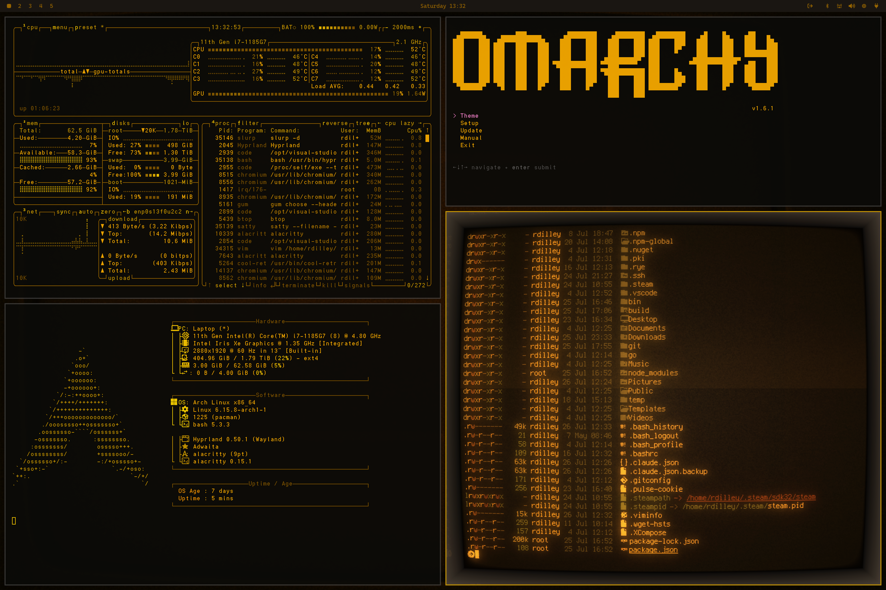

# Omarchy RetroPC Theme

This is the RetroPC Theme for [Omarchy.org](https://omarchy.org), providing a retro, cohesive and visually appealing configuration set for your Linux desktop environment.

<p align="center">
  
</p>

```
Remote terminals hum, a whisper in the wires,
Echoes of code beneath phosphor-lit spires.
Typing in shadows, the amber screen glows—
Revealing secrets only silence knows.
Old-school intrusion, soft light, sharp mind—where legends in dim rooms rewrote mankind.
```

## Installation

To install this theme, simply use the `omarchy-theme-install` command:

```bash
omarchy-theme-install https://github.com/rondilley/omarchy-retropc-theme
```

## Included Configurations

This theme includes configurations for:

- Alacritty (alacritty.toml)
- btop (btop.theme)
- Hyprland (hyprland.conf, hyprlock.conf)
- Mako (mako.ini)
- Neovim (neovim.lua)
- Waybar (waybar.css)
- Wofi (wofi.css)
- Walker (walker.css)
- SwayOSD (swayosd.css)
- Desktop Background (backgrounds/amber_tube.jpg)
- Font (fonts/Bm437_IBM_XGA-AI_12x23.otb)

## Recommended additions
Cool Retro Term
```bash
sudo pacman -S cool-retro-term
```
Retro Font
```bash
mkdir ~/.local/share/fonts/retro
cp fonts/Bm437_IBM_XGA-AI_12x23.otb ~/.local/share/fonts/retro
fc-cache
```

## Using Retro Fonts

**Don't forget to comment out the font definitions in ~/.config/alacritty.toml**

```
#[font]
#normal = { family = "CaskaydiaMono Nerd Font", style = "Regular" }
#bold = { family = "CaskaydiaMono Nerd Font", style = "Bold" }
#italic = { family = "CaskaydiaMono Nerd Font", style = "Italic" }
#size = 9
```

## Inspiration
[https://github.com/bjarneo/omarchy-ash-theme](https://github.com/bjarneo/omarchy-ash-theme)

## X.com
[Ron_Dilley](https://x.com/Ron_Dilley)